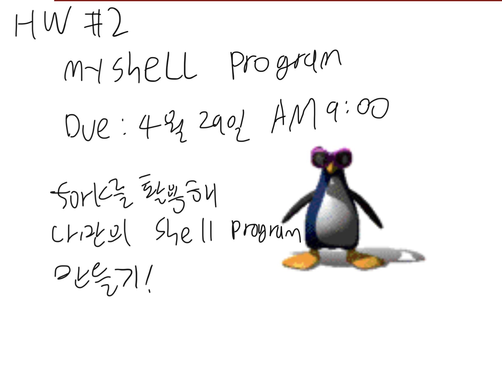

* [fork() in c](http://www.csl.mtu.edu/cs4411.ck/www/NOTES/process/fork/create.html)
> main 프로그램과 동일한 프로그램을 복사한다.  
> parent에겐 child의 pid를 리턴  
> child에겐 0을 리턴  

* [getpid in c](https://www.includehelp.com/c/getpid-and-getppid-functions-in-c-linux.aspx)
> 프로세스의 id를 알려준다

* makefile이 안되면
```bash
$ gcc -o myShell main.c pwd.c
```
* [make linux shell in c](https://www.geeksforgeeks.org/making-linux-shell-c/)
* [wite a shell in c](https://brennan.io/2015/01/16/write-a-shell-in-c/)
* [c로 shell command 만들기](https://github.com/Reevid/shell/blob/master/shell.c)
* [나만의 shell command 만들기 in c](https://splug.tistory.com/186)
* []()

