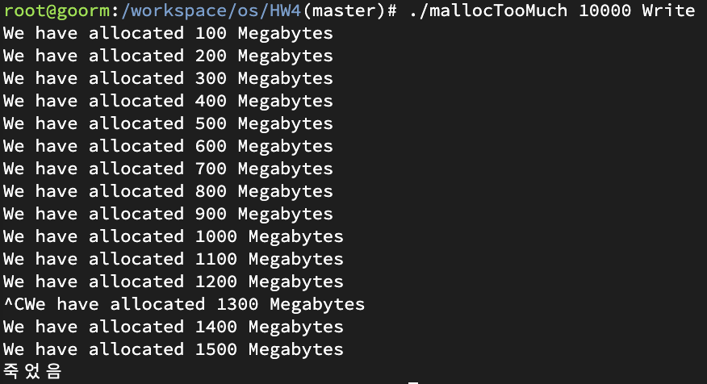
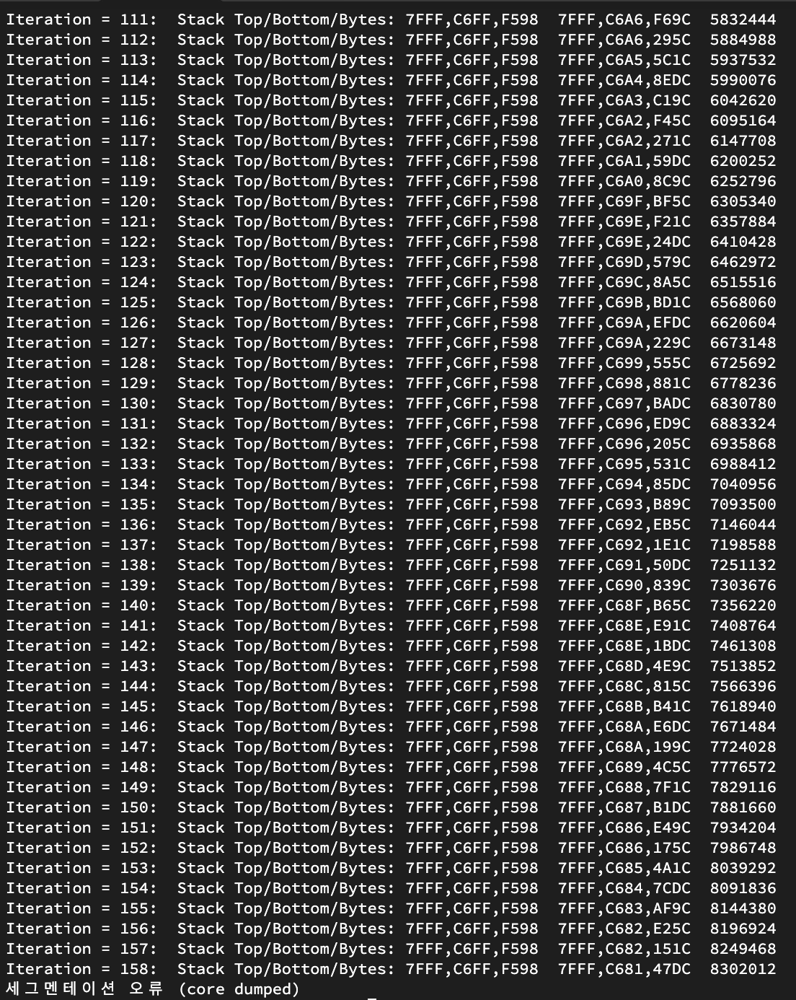
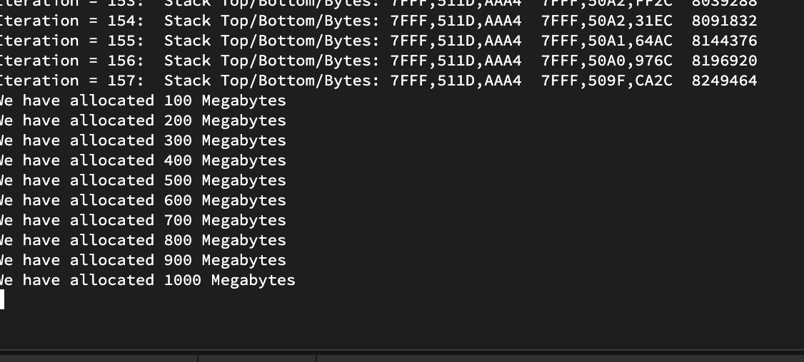
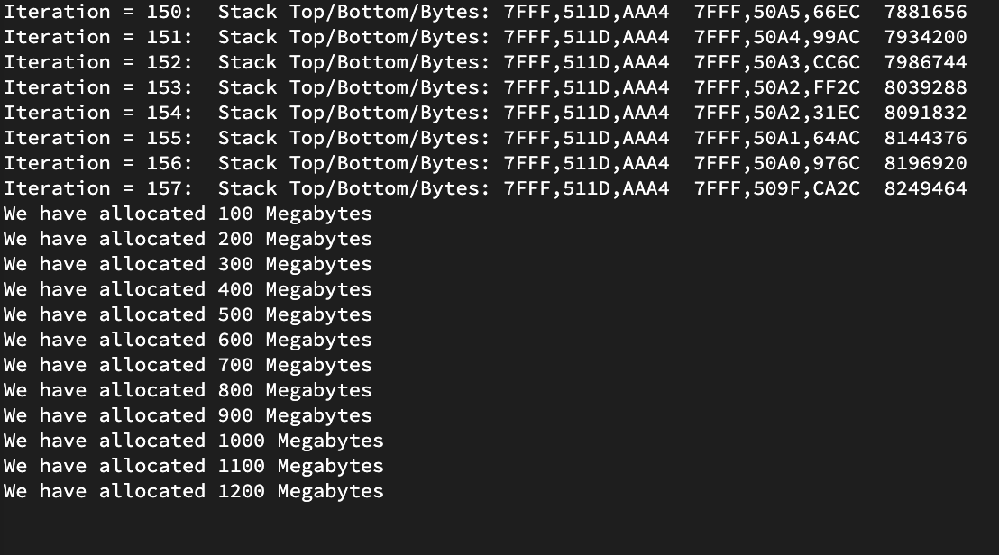
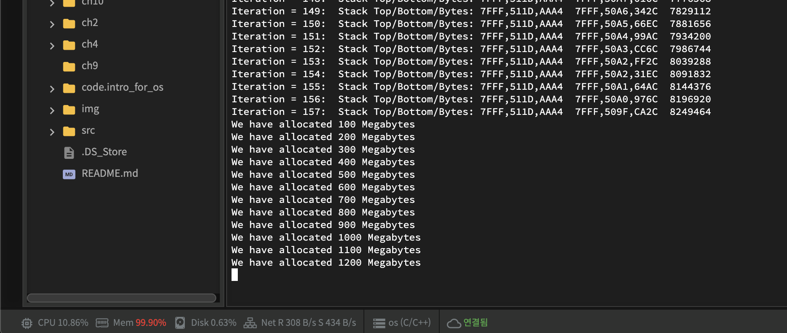
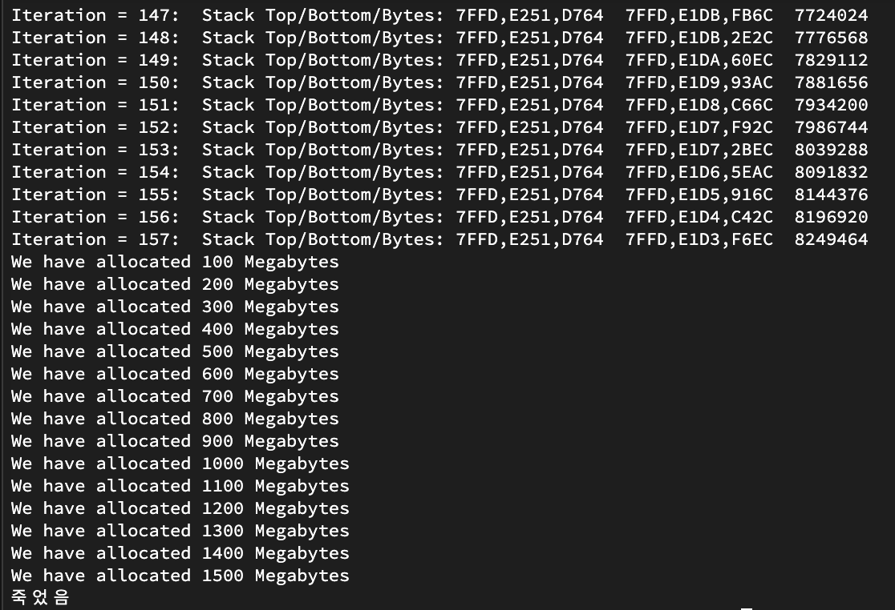

# HW4
> Stack과 Heap이 공유하는 메모리 Segment를 확인해 보자

### 첨부한 코드를 바탕으로 
[MallocTooMuch](mallocTooMuch.c) 

`malloc`은 `Heap` 영역을 사용해 동적 메모리를 할당합니다
```
Nothing = 1
Read = 2
Write = 3
```
[recursiveCall](recursiveCall.c)  


1. Stack과 Heap을 증가시키면서 충돌하는 지점을 찾고 
2. 이 때 Stack과 Heap 각각의 크기와 총 메모리 Segment의 크기를 구하고 
3. Stack과 Heap의 크기를 달리하여 다른 지점에서 충돌시켜 처음 경우와 결과를 비교해 보시면 됩니다.







